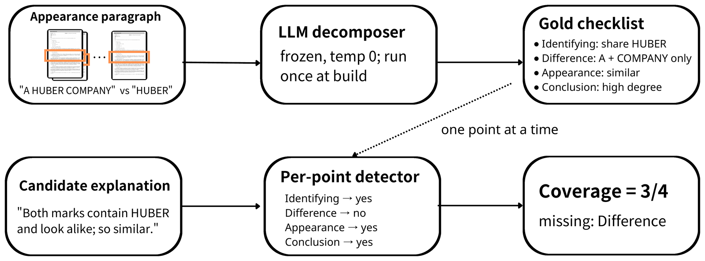

# LETITBE

**L**egal-**E**xaminer a**T**om**I**c poin**T**-**B**ased **E**valuation, the explanation-coverage metric of VERTAG (ACCV 2026).

LETITBE scores a candidate explanation of trademark similarity against the reason points a TIPO examiner actually recorded. An LLM per-point detector decides, for each gold reason point separately, whether the candidate entails it; coverage is the fraction of points hit, macro-averaged over cases. Entailment is judged semantically: a paraphrase counts, a polarity reversal does not. Because each point traces to a factor in §5.2 of TIPO's examination guidelines, a score decomposes into an auditable list of covered and missed reasons rather than an opaque scalar.



## Contents

```
LETITBE/
├── letitbe.py                     score explanations, evaluate a detector
├── preprocess.py                  office actions -> reason points -> training pairs
├── finetune.py                    QLoRA fine-tune a detector
├── PROMPTS.md                     both prompts verbatim, and why they are specification
├── requirements.txt
├── .env.example
├── assets/
│   └── pipeline.png               the figure above
└── examples/                      input-format examples only, not a dataset
    ├── coverage.example.jsonl     5 records: candidate + gold reason points
    ├── detector.example.jsonl     5 records: candidate + one claim + label
    └── SCHEMA.md                  field-by-field input formats
```

## 1. Install

Every command below runs from `VERTAG/LETITBE`.

```bash
git clone https://github.com/spaces-lalala/VERTAG.git
cd VERTAG/LETITBE
pip install openai                  # enough for scoring through Ollama or any OpenAI-compatible API
pip install -r requirements.txt     # the rest: --backend hf, decompose, fine-tuning
```

Credentials and endpoints are read from the environment. Copy [`.env.example`](.env.example) to `.env`, fill in what you need, and load it:

```bash
cp .env.example .env
set -a; source .env; set +a
```

Nothing is required up front. Each variable is read only by the step that needs it, so an empty `.env` is fine until you run that step.

## 2. Run the examples

The reference engine is self-hosted, so bring one up first. With [Ollama](https://ollama.com):

```bash
ollama serve &                       # skip if it is already running
ollama pull qwen2.5:7b               # about 4.7 GB
```

Any OpenAI-compatible endpoint works; point `--base-url` at it instead. For OpenAI itself, set `OPENAI_API_KEY` and pass a `gpt-*` engine, which needs no local server.

```bash
python letitbe.py coverage --input examples/coverage.example.jsonl --engine qwen2.5:7b
```

Each example's candidate is the examiner's own passage, so these examples should generally score highly and serve as a smoke test. The reference configuration can miss difference points, so a score below 1.0 is not by itself an error; scores consistently lower than expected across the examples may indicate a configuration or inference problem.

## 3. Score your own explanations

Put one case per line: the candidate text, and the gold reason points it should be measured against. [`examples/SCHEMA.md`](examples/SCHEMA.md) gives every field.

```bash
python letitbe.py coverage --input your_data.jsonl --engine qwen2.5:7b \
    --output results.jsonl
```

`--output` writes one row per case with the per-point hit flags, so a score can be traced back to the reasons it missed. If that file already exists, finished rows are skipped, so an interrupted run resumes by repeating the command. With `--backend hf`, a resumed run batches the remaining rows differently, which can flip a borderline judgment; for an exact comparison, start from an empty output file.

To evaluate a detector rather than score explanations, give it labelled candidate-claim pairs:

```bash
python letitbe.py detector --input examples/detector.example.jsonl --engine qwen2.5:7b
```

It reports precision, recall and F1 broken down by how each negative was built. Accuracy on `hard_neg` is the primary diagnostic: a detector that matches on surface overlap accepts polarity flips and scores near zero there.

## 4. Choose an engine

Use **`Qwen2.5-7B-Instruct` zero-shot**, the reference engine behind the paper's coverage figures. Any other engine must first pass the qualification gate: **boilerplate coverage no higher than 0.05, and a strictly monotone decline across full, ablate-1, ablate-half and wrong.**

```bash
python letitbe.py qualify --input your_gold.jsonl --engine <engine>
```

It reads only the gold reason points; the `cand` field is ignored.

Use the prompt in [`PROMPTS.md`](PROMPTS.md) verbatim; do not translate or paraphrase it.

The released adapters are per-point **classifiers**, not coverage engines; they fail the boilerplate criterion above. Load one with `--backend hf` under the `detector` subcommand:

```bash
python letitbe.py detector --input your_pairs.jsonl \
    --backend hf --engine google/gemma-2-9b-it --adapter annieyii/letitbe-hitdet-gemma2-9b
```

`google/gemma-2-9b-it` is gated; accept its terms on Hugging Face and set `HF_TOKEN` first ([FAQ](../README.md#faq)).

### Released adapters

| Adapter | Base model |
|---|---|
| [`annieyii/letitbe-hitdet-gemma2-9b`](https://huggingface.co/annieyii/letitbe-hitdet-gemma2-9b) | `google/gemma-2-9b-it` |
| [`annieyii/letitbe-hitdet-breeze-7b`](https://huggingface.co/annieyii/letitbe-hitdet-breeze-7b) | `MediaTek-Research/Breeze-7B-Instruct-v1_0` |

Each model card on Hugging Face carries the prompt format, measurements, training setup and license. An adapter is **not** covered by this repository's licenses: each inherits its base model's terms, and for `gemma-2-9b` that means the Gemma Terms of Use.

## 5. Build the corpus yourself

The trademark images, the office action corpus, the decomposed corpus and the evaluation sets used in the paper are not distributed here. Everything below assumes you have obtained the source material first.

The corpus is built from TIPO rejection dispositions (核駁審定書, `dptKind = REJ`), public administrative dispositions issued by the Taiwan Intellectual Property Office. The collection used in the paper covers examination numbers T0300000 to T0454297 and was retrieved in May and June 2026.

**Trademark images.** Marks are identified by their public registration numbers. TIPO publishes mark images through its patent and trademark open data service and its official trademark search system; look up a registration number there and save the image you need. We do not mirror, bulk-distribute, or provide collection tooling for these images.

**Office action documents.** These are public administrative dispositions issued by TIPO. We do not redistribute the corpus and we do not provide collection tooling for it. Users must obtain these documents directly from TIPO.

**Derived artifacts.** For the decomposed corpus, the gold checklists, or the evaluation subsets used in the paper, contact **matywu@gmail.com** with a short description of your intended use. These are released under CC BY-NC 4.0 and may not be used commercially.

With the source corpus in hand:

```bash
python preprocess.py decompose --corpus <corpus.jsonl>   # needs GEMINI_API_KEY
python preprocess.py split     --corpus <corpus.jsonl>
python preprocess.py build-pairs
python preprocess.py build-500
```

The decomposer is an LLM at temperature 0, not a deterministic parser, so a rerun will not be byte-identical to the checklists used in the paper. Every other step is deterministic.

## 6. Train your own detector

```bash
python finetune.py prepare
python finetune.py train --base google/gemma-2-9b-it --out models/hitdet_gemma \
    --batch 4 --grad-accum 4        # gemma's 256k vocabulary runs out of memory at batch 8; the effective batch is still 16
```

`finetune.py train --smoke` runs two steps on 32 examples and saves nothing, which checks a GPU setup at low cost before a full run.

---

## License

See the [root README](../README.md). Code is MIT, data artifacts are CC BY-NC 4.0, and commercial use of the data is prohibited. The released adapters are not covered by either license; each inherits its base model's terms.
