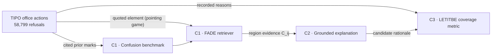

<div align="center">

# VERTAG: Visual Examiner Rationales for Trademarks with Atomic Grounding

### A Confusion Benchmark, Faithful Retriever, and Explanation-Coverage Metric

**ACCV 2026**

Sheng-Yuan Yen<sup>1</sup>, Chia-Yi Chou<sup>2</sup>, Chi-Tse Peng<sup>2</sup>, Chian-Yu Ye<sup>3</sup>, Tsan-Wei Yu<sup>4</sup>, Chih-Chun Ko<sup>2</sup>, Yi-Chieh Wu<sup>5</sup>

<sup>1</sup>Institute of Multimedia Engineering, National Yang Ming Chiao Tung University<br>
<sup>2</sup>Department of Computer Science, National Chengchi University<br>
<sup>3</sup>Department of Law, National Chengchi University<br>
<sup>4</sup>Department of Tsing Hua College, National Tsing Hua University<br>
<sup>5</sup>Interdisciplinary Artificial Intelligence Center, National Chengchi University

Paper (coming soon) · [Benchmark](benchmark/) · [Models](#model-zoo) · [Citation](#citation)

[](#citation)
[](LICENSE)
[](LICENSE-DATA)

</div>

Trademark examiners justify a likelihood-of-confusion refusal by naming the element that drives the conflict, yet trademark retrieval is evaluated on visual near-duplicates and its explanations are never checked against what examiners recorded. VERTAG grounds retrieval and its explanations in **58,799 office actions of the Taiwan Intellectual Property Office (TIPO)**. Each office action pairs an applied mark with the prior mark(s) it was refused over and states, in prose, why they are confusingly similar, so it supplies three expert ground truths at once: a retrieval label (the cited marks), a localization target (the element the examiner quotes) and a checklist of the reasons the examiner gave.



## Contents

| Directory | Contribution | Released |
|---|---|---|
| [`benchmark/`](benchmark/) | **C1** The examiner-confusion retrieval benchmark: 10,215 held-out queries whose relevant items are the prior marks the examiner cited, over an 83,336-mark register (G1) and a ~1M-distractor variant (G2) | query ids, relevance labels, gallery ids |
| [`FADE/`](FADE/) | **C1** FADE, a faithful additive descriptor whose retrieval cosine decomposes exactly into patch-pair contributions $C_{ij}$ | inference, $C_{ij}$ explanations, benchmark and METU-v2 evaluation |
| [`explainer/`](explainer/) | **C2** Grounded explanation: Qwen2.5-VL writes examiner-style rationales from the marks and FADE's region evidence | inference |
| [`LETITBE/`](LETITBE/) | **C3** Explanation-coverage metric grounded in examiner reasoning | scoring, detector evaluation, corpus tools, detector fine-tuning |

The training code of FADE and of the explainer is not part of this release.

## News

- **2026-10** Benchmark labels, FADE and explainer inference code, and the LETITBE metric are released.
- VERTAG is accepted to **ACCV 2026**.

## Installation

```bash
git clone https://github.com/<owner>/<repo>.git VERTAG
cd VERTAG
```

Each component has its own requirements (Python 3.10):

| Component | Install | Hardware |
|---|---|---|
| FADE | `pip install -r FADE/requirements.txt` | one GPU; the benchmark encodes ~94k images per model (G2: ~1M) |
| explainer | `pip install -r explainer/requirements.txt` | GPU with ~17 GB free (Qwen2.5-VL-7B in bf16) |
| LETITBE | see [`LETITBE/README.md`](LETITBE/README.md) | an Ollama server or any OpenAI-compatible endpoint |

## Data

- **Benchmark labels** are in [`benchmark/`](benchmark/) under CC BY-NC 4.0. They contain only public TIPO identifiers; the mark images are not redistributed and are looked up by registration number and case number in TIPO's official trademark search system (see [`benchmark/README.md`](benchmark/README.md)).
- **METU-v2** ([Tursun et al., 2017](https://github.com/neouyghur/METU-TRADEMARK-DATASET)) provides the G2 distractors and the near-duplicate benchmark; it is available from its authors on request.
- **The office-action corpus** is not redistributed; see [`LETITBE/README.md`](LETITBE/README.md#5-build-the-corpus-yourself) for the source material and for the derived artifacts.

## Model Zoo

| Component | Model | Base model | Paper | Download |
|---|---|---|---|---|
| FADE | `fade_dinov2_vitl14_reg` | DINOv2-L/14-reg | Tab. 3, Fig. 3 | coming soon |
| FADE | `fade_siglip_so400m` | SigLIP-SO400M/14, 224 px | Tab. 4 | coming soon |
| explainer | LoRA, content rows | Qwen2.5-VL-7B-Instruct | Tab. 5 | coming soon |
| explainer | LoRA, registration-number row | Qwen2.5-VL-7B-Instruct | Tab. 5 | coming soon |
| LETITBE | reference engine | Qwen2.5-7B-Instruct, zero-shot | Tab. 6 | via [Ollama](https://ollama.com) (`qwen2.5:7b`) |
| LETITBE | [`annieyii/letitbe-hitdet-gemma2-9b`](https://huggingface.co/annieyii/letitbe-hitdet-gemma2-9b) | gemma-2-9b-it | Tab. 6 | Hugging Face |
| LETITBE | [`annieyii/letitbe-hitdet-breeze-7b`](https://huggingface.co/annieyii/letitbe-hitdet-breeze-7b) | Breeze-7B-Instruct-v1_0 | Suppl. S8 | Hugging Face |

The FADE files go in `FADE/checkpoints/`; [`FADE/README.md`](FADE/README.md#2-checkpoints) and [`explainer/README.md`](explainer/README.md#2-adapters) describe them.

## Quick start

**C1, FADE.** Explain a pair, search a gallery, evaluate on the benchmark ([`FADE/README.md`](FADE/README.md)):

```bash
cd FADE
python explain.py --checkpoint checkpoints/fade_dinov2_vitl14_reg.safetensors \
    --applied applied.jpg --cited cited.jpg
python retrieve.py --checkpoint checkpoints/fade_dinov2_vitl14_reg.safetensors \
    --gallery /path/to/gallery_dir --query query.jpg --explain 3
python evaluate.py --checkpoint checkpoints/fade_dinov2_vitl14_reg.safetensors --images /path/to/images
```

**C2, explainer.** FADE's region evidence first, then the rationale ([`explainer/README.md`](explainer/README.md)):

```bash
(cd FADE && python explain.py --checkpoint checkpoints/fade_dinov2_vitl14_reg.safetensors \
    --pairs examples/pairs.example.jsonl --image-root /path/to/images \
    --evidence-out outputs/explain/evidence.json)
cd explainer
python generate.py --pairs ../FADE/examples/pairs.example.jsonl --image-root /path/to/images \
    --condition C --evidence ../FADE/outputs/explain/evidence.json --adapter ADAPTER
```

**C3, LETITBE.** Score an explanation against the examiner's reason points ([`LETITBE/README.md`](LETITBE/README.md)):

```bash
cd LETITBE
python letitbe.py coverage --input examples/coverage.example.jsonl --engine qwen2.5:7b
```

## Results

Retrieval on the examiner-confusion benchmark (G1: 83,336-mark register; G2: the register within 1,006,262 images; 10,215 queries) and on METU-v2 near-duplicates (922,926 images, 417 queries), from Tab. 3 and 4 of the paper:

| Model | Explanation | G1 mAP@100 | G1 R@100 | G1 PRES@100 | G2 R@100 | METU-v2 mAP@100 |
|---|---|---|---|---|---|---|
| DINOv2-B/14 (frozen) | – | 0.028 | 0.080 | 0.054 | – | – |
| DINOv2-L/14-reg GeM (frozen) | – | 0.026 | 0.079 | 0.054 | 0.063 | 0.300 |
| EVA02-CLIP-L/14 (frozen) | – | 0.173 | 0.445 | 0.330 | – | – |
| SigLIP-SO400M (frozen) | – | 0.220 | 0.512 | 0.393 | 0.385 | 0.343 |
| DINOv2-L + FADE | exact $C_{ij}$ | 0.048 | 0.146 | 0.093 | 0.123 | 0.316 |
| SigLIP + FADE | exact $C_{ij}$ | **0.319** | **0.609** | **0.500** | **0.548** | 0.321 |

The same trained descriptor barely moves near-duplicate retrieval but roughly doubles examiner-confusion retrieval with DINOv2 (R@100 +85% on G1), and its $C_{ij}$ readout localizes the element the examiner names. With the explainer, region evidence does not raise the element recall of the fine-tuned model, while giving it the cited registration number cuts fabricated registration numbers from 100% to 5% (Tab. 5). LETITBE is the only tested metric that rejects shared boilerplate and drops clearly when the similarity-degree conclusion is removed (0.81 → 0.64, against 1.00 → 0.97 for a holistic LLM judge; Tab. 6).

## Citation

```bibtex
@inproceedings{yen2026vertag,
  title     = {{VERTAG}: Visual Examiner Rationales for Trademarks with Atomic Grounding --- A Confusion Benchmark, Faithful Retriever, and Explanation-Coverage Metric},
  author    = {Yen, Sheng-Yuan and Chou, Chia-Yi and Peng, Chi-Tse and Ye, Chian-Yu and Yu, Tsan-Wei and Ko, Chih-Chun and Wu, Yi-Chieh},
  booktitle = {Proceedings of the Asian Conference on Computer Vision (ACCV)},
  year      = {2026}
}
```

## Acknowledgements

This release builds on [DINOv2](https://github.com/facebookresearch/dinov2), [SigLIP](https://huggingface.co/google/siglip-so400m-patch14-224), [Qwen2.5-VL](https://huggingface.co/Qwen/Qwen2.5-VL-7B-Instruct) and [PEFT](https://github.com/huggingface/peft), and evaluates on [METU-v2](https://github.com/neouyghur/METU-TRADEMARK-DATASET).

## Contact

matywu@gmail.com

## Copyright and Terms of Use

Copyright (c) 2026 VERTAG authors.

- **Code**: MIT License. See [LICENSE](LICENSE).
- **Data artifacts**: Creative Commons Attribution-NonCommercial 4.0 International (CC BY-NC 4.0). See [LICENSE-DATA](LICENSE-DATA). **Commercial use of the data artifacts is prohibited.**
- **Automated crawling, scraping, or bulk downloading of this repository is prohibited.** This is a condition of access to this repository and does not modify the MIT or CC BY-NC 4.0 grants above.
- Third-party trademark images and the TIPO office action corpus are **not** redistributed here; a handful of passages are quoted verbatim in the format examples and prompts. Each cited mark is identified by its public registration number and can be looked up in TIPO's official trademark search system.

## 著作權與使用條款

版權所有 (c) 2026 VERTAG 作者群。

- **程式碼**：MIT 授權，見 [LICENSE](LICENSE)。
- **資料**：CC BY-NC 4.0 授權，見 [LICENSE-DATA](LICENSE-DATA)。**禁止一切商業使用。**
- **禁止對本儲存庫進行自動化爬取、抓取或大量下載**。此為取用本儲存庫之條件，不變更上述 MIT 與 CC BY-NC 4.0 之授權範圍。
- 本儲存庫**不**散布第三方商標圖樣，亦不散布經濟部智慧財產局核駁審定書語料；格式範例與 prompt 中引用了少數段落原文。每一件引證商標均以其公開註冊號標示，可自智慧局官方商標檢索系統查得。
